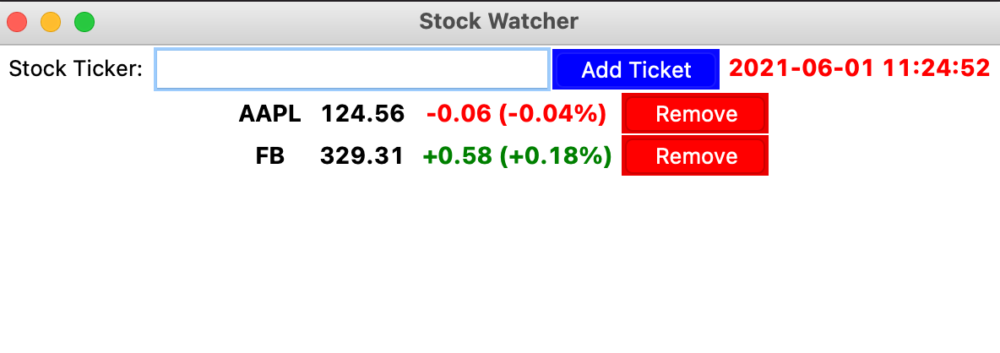
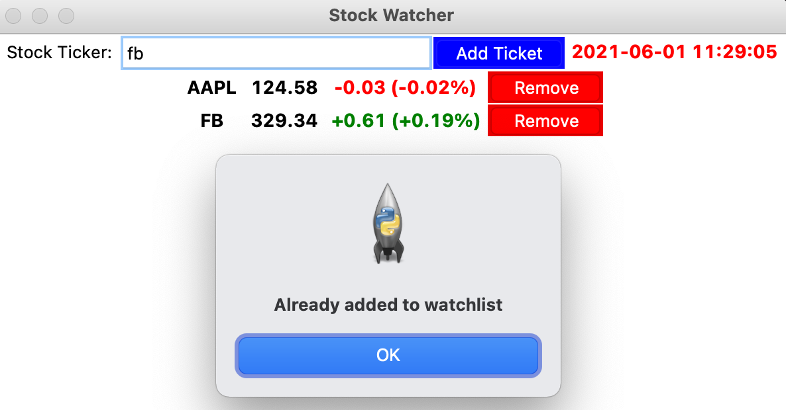

# stock-watcher

## Description
- This is a simple stock watcher application built using Python

## How to run the program
- Clone the repository
- Use `python main.py` to run the application

## Screenshots
- 
- 
